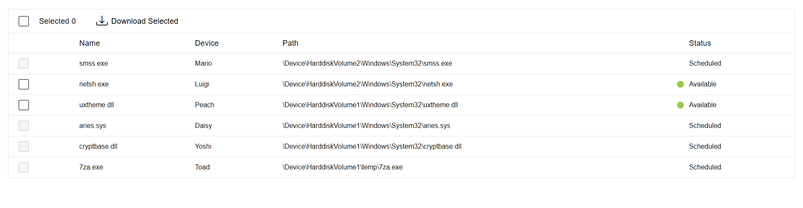

# File Downloader



## How to run the app

In your terminal, `cd` into the project folder.

Then run the installation command as follows:

```bash
npm i
```

Then start the development server as follows:

```bash
npm run dev
```

Open [http://localhost:3000](http://localhost:3000) with your browser to see the result.

## How to run the tests

In your terminal, `cd` into the project folder, then run the following command:

```bash
npm run test
```

## To do

- add Jest linting
- add more linting to enforce uniformity in imports (e.g., sorting and merging)
- thorough accessibility review
- change the SASS compiler to prevent legacy-js-api warnings
- move the component to storybook rather than bootstrapping with Next.JS (which is overkill for a single component)

## UX decision

There was a requirement to only allow available files to be downloaded. The screenshot provided with the exercise shows that rows that aren't available can be hovered over and selected (the cursor is a pointer).

I made a usability decision to effectively "disable" any rows from being selected if they do not have an available status with a disabled checkbox and not-allowed cursor. This gives the user up front information on functionality rather than an expectation that the file can be downloaded because the row can be selected.

The select all checkbox then only operates on the available rows.

The alternative (which I also added) was allowing selection, but simply filtering out the unavailable files on download.

I would love to discuss this decision with the team and am happy to undo this if it's not what was requested or desired.
